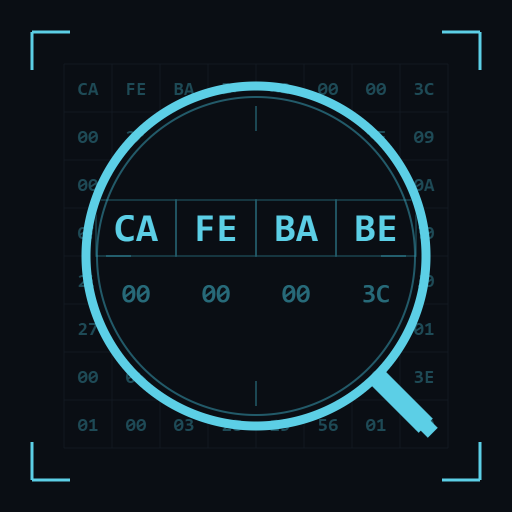
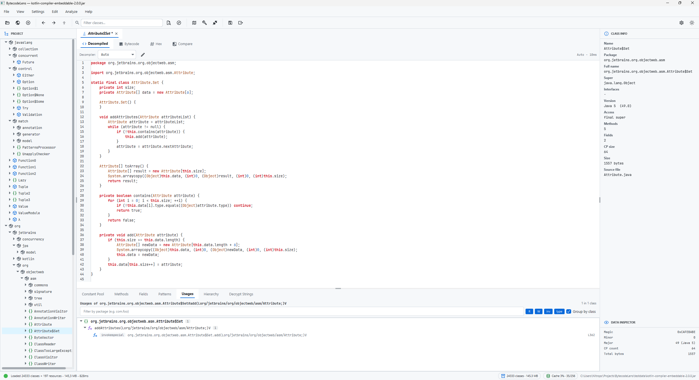

# BytecodeLens

**The Java RE cockpit — decompile, attach, diff, patch.**

[](LICENSE)
[](https://github.com/Share-devn/bytecodelens/releases)
[](https://adoptium.net)
[](#)
[](https://github.com/Share-devn/bytecodelens/stargazers)

<br clear="left"/>

A modern desktop reverse-engineering tool for Java / JVM bytecode. Four decompilers with automatic fallback, live JVM attach with hot-reload, industrial hex viewer with structure overlay, deobfuscation pipeline, headless CLI.

> **If this project helps you, please star it ⭐ — it helps others discover it.**



---

## Why BytecodeLens

A desktop reverse-engineering workbench for the JVM. Not a decompiler UI — a cockpit that combines the best of JADX, Recaf, and JD-GUI, plus capabilities none of them have.

- **Four decompilers with fallback that never fails.** CFR · Vineflower · Procyon · ASM-skeleton. The `Auto` chain tries each with a 15-second timeout and falls through — you never see a blank tab.
- **Live JVM attach + inspector.** Attach to a running process by PID. Nine tabs of live data: heap/threads/CPU line charts, thread stack traces, deadlock detection, GC stats, per-pool memory breakdown. Hot-reload redefined classes into the target.
- **Industrial hex viewer.** Structure overlay that parses `.class` / ZIP / PNG into a clickable tree. Data inspector with 17 type interpretations (LE+BE). Find by hex/ASCII/UTF-16, go-to offset, copy as C-array, Shannon entropy graph, binary diff.

## Features

### Editor
- Decompiled / Bytecode / Hex / Compare tabs per class
- Compare tab with dynamic columns and per-column engine selector
- Edit decompiled source → javac recompile with phantom classes
- Assembler DSL for raw bytecode patching
- Hover highlight identifiers, Ctrl+click go-to-declaration, caret-line highlight
- Syntax themes: Primer Dark/Light, Dracula, Monokai, Solarized Dark/Light

### Navigation & xref
- Expandable class tree (methods + fields inline, IntelliJ-style)
- Preview + pinnable tabs, drag-reorder, detach window
- Find Usages (Alt+F7 / X) with hierarchical tree, filter bar, code snippet preview under each call site
- Overriders / implementers appear in Find Usages results
- Recursive callers-of-callers tree with cycle detection
- Go to Class (Ctrl+N) fuzzy, Back / Forward navigation history
- Background decompile cache — package neighbours pre-warmed on a low-priority thread

### Deobfuscation
11 transformation passes, plus two anti-tamper helpers:
- Dead Code Removal · Unreachable-After-Terminator (SC2-style) · Opaque Predicate Simplification
- Static Value Inlining · Call Result Inlining · Enum Name Restoration
- Illegal Name Mapping · Kotlin Name Restoration · Kotlin Data-Class Restoration
- Source Name Restoration · Stack Frame Removal
- Strip `Code` on field · Remove illegal annotations

### Mapping
11 formats, both read and write:
- ProGuard/R8 · Tiny v1 · Tiny v2 · SRG · XSRG · TSRG · TSRG v2 · CSRG · JOBF · Enigma · Recaf
- Mapping diff / compose / invert for stacked refactor workflows
- Content-sniffing loader picks the right parser by file content, not extension

### Search
- Modes: Strings · Names · Bytecode · Regex · Numbers · **Comments** (your own notes)
- String literal xref index built on load
- Streaming results with cancel + sort dropdown + progress
- Per-workspace package exclusion glob

### JVM attach
- `VirtualMachine.attach(pid)` with dynamically-built agent jar
- Inspector opens **instantly** after attach — doesn't wait for a full class dump
- Live line charts refresh every 2 seconds (configurable)
- Hot-swap classes via `Instrumentation.redefineClasses`

### Headless CLI
```bash
bytecodelens decompile app.jar -o out/ --engine auto
bytecodelens analyze app.jar --report-json report.json
bytecodelens mappings convert input.srg --to TINY_V2 -o output.tiny
bytecodelens mappings diff base.srg updated.srg --report-json diff.json
```
No JavaFX runtime loaded in CLI mode.

### Customisation
- Full Settings window (Ctrl+,) with live-apply — 13 sections, ~50 toggles
- Customisable keybindings with IntelliJ / VSCode / Recaf / Default presets
- Per-workspace state: open tabs, divider positions, excluded packages, comments

## Requirements

- **Java 21 or newer** (tested on JDK 25) — [Adoptium Temurin](https://adoptium.net) recommended
- Windows 10+ / macOS 12+ / Linux (x64)

## Install

Pick your platform on the [latest release page](https://github.com/Share-devn/bytecodelens/releases/latest):

| Platform | Package | Notes |
|---|---|---|
| **Windows** | [`BytecodeLens-windows-x64.msi`](https://github.com/Share-devn/bytecodelens/releases/latest/download/BytecodeLens-windows-x64.msi) | Installer with Start Menu shortcut |
| **macOS** (Apple Silicon) | [`BytecodeLens-macos-aarch64.dmg`](https://github.com/Share-devn/bytecodelens/releases/latest/download/BytecodeLens-macos-aarch64.dmg) | Drag to Applications |
| **macOS** (Intel) | [`BytecodeLens-macos-x64.dmg`](https://github.com/Share-devn/bytecodelens/releases/latest/download/BytecodeLens-macos-x64.dmg) | Drag to Applications |
| **Linux** (Debian / Ubuntu) | [`BytecodeLens-linux-x64.deb`](https://github.com/Share-devn/bytecodelens/releases/latest/download/BytecodeLens-linux-x64.deb) | `sudo dpkg -i BytecodeLens-linux-x64.deb` |
| **Any OS** (portable) | [`BytecodeLens-1.0.0-all.jar`](https://github.com/Share-devn/bytecodelens/releases/latest/download/BytecodeLens-1.0.0-all.jar) | `java -jar BytecodeLens-1.0.0-all.jar` |

Native installers bundle a JRE — no separate Java install needed. The portable jar requires Java 21+ on PATH.

## Build from source

```bash
git clone https://github.com/Share-devn/bytecodelens.git
cd bytecodelens
./gradlew run         # launch the GUI
./gradlew shadowJar   # build bytecodelens-<version>-all.jar
./gradlew test        # 474 tests
```

## CLI usage

The same jar doubles as a headless tool. The first positional argument decides the mode — recognised subcommands skip the JavaFX runtime entirely.

```bash
java -jar bytecodelens-1.0.0-all.jar help
java -jar bytecodelens-1.0.0-all.jar decompile app.jar -o out/
java -jar bytecodelens-1.0.0-all.jar analyze app.jar --report-json report.json
```

## Contributing

Pull requests are welcome. See [CONTRIBUTING.md](CONTRIBUTING.md) for the build + style notes.

## License

Apache License 2.0 — see [LICENSE](LICENSE).

## Credits

Built on top of excellent open-source projects:

- [CFR](https://github.com/leibnitz27/cfr) · [Vineflower](https://github.com/Vineflower/vineflower) · [Procyon](https://github.com/mstrobel/procyon) — decompilers
- [ASM](https://asm.ow2.io/) — bytecode library
- [AtlantaFX](https://github.com/mkpaz/atlantafx) — JavaFX theme
- [RichTextFX](https://github.com/FXMisc/RichTextFX) — code editor widget
- [Ikonli](https://kordamp.org/ikonli/) — iconography
- [ControlsFX](https://controlsfx.github.io/) — extra JavaFX controls

Inspired by [JADX](https://github.com/skylot/jadx), [Recaf](https://github.com/Col-E/Recaf), and [JD-GUI](https://github.com/java-decompiler/jd-gui).

## Comparison

|                               | BytecodeLens | Recaf | JADX | JD-GUI |
|-------------------------------|:---:|:---:|:---:|:---:|
| Four decompilers with fallback | ✅ | ❌ | ❌ (single) | ❌ (single) |
| Compare decompilers side-by-side | ✅ | ❌ | ❌ | ❌ |
| Edit + recompile Java          | ✅ | ✅ | ❌ | ❌ |
| Live JVM attach + inspector    | ✅ (9 tabs) | ✅ (6 tabs) | ❌ | ❌ |
| Hex viewer with structure overlay | ✅ | ⚠️ | ⚠️ | ❌ |
| Mapping formats                | **11** | 13+ | 13+ | ❌ |
| Deobfuscation passes           | **11 + 2** | 23 | Plugin | ❌ |
| Headless CLI                   | ✅ | ✅ | ✅ | ❌ |
| String decryption              | ✅ (BLPL + sim) | ❌ | Plugin | ❌ |
| JNI demangler                  | ✅ | ❌ | ❌ | ❌ |
| Android (APK / DEX)            | ❌ | ✅ | ✅ | ❌ |
| License                        | Apache 2.0 | MIT | Apache 2.0 | GPL-3.0 |

## Keywords

Java decompiler · JVM bytecode editor · bytecode viewer · reverse engineering · deobfuscation · JVM reverse engineering · Java bytecode analysis · jar analyzer · class file viewer · CFR decompiler · Vineflower · Procyon · ASM · hex editor · JVM attach · JavaFX bytecode tool · static analysis · obfuscator detection · Kotlin decompiler · Java hot reload · mapping converter · SRG · TSRG · Tiny · Enigma · Recaf alternative · JADX alternative · JD-GUI alternative
